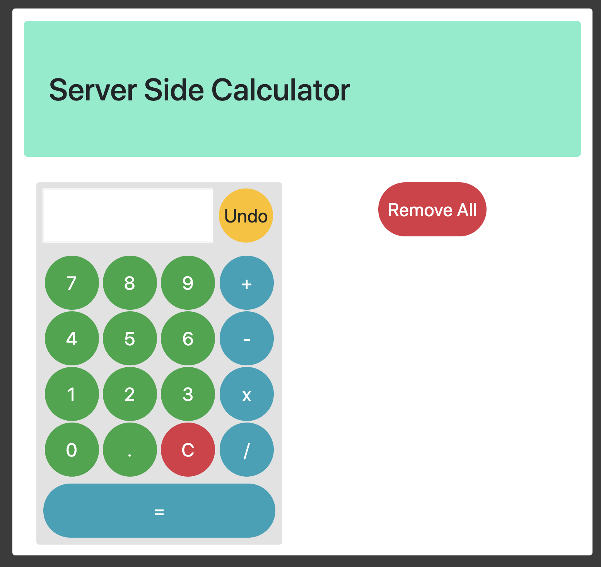
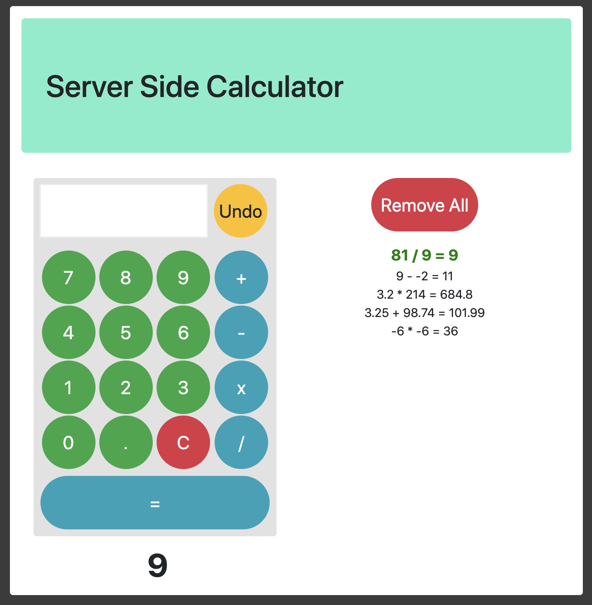

## Server-Side Calculator

In this challenge, I created a calculator interface that can accept any two numbers and add, subtract, multiply or divide them.  The numbers get stored in an object on the client side, then are posted to the server for calculation.  The server sends back the result, which displays for the user on the DOM.

### Prerequisites

This software is required prior to starting the application.

- [Node.js](https://nodejs.org/en/)

### Installation

Steps to get the development environment running.

1) Download this project and open in your preferred IDE.
2) `npm install`
3) `npm start`

### Technologies Used

Built with jQuery, Node.js, and Bootstrap.

### Screenshots:

